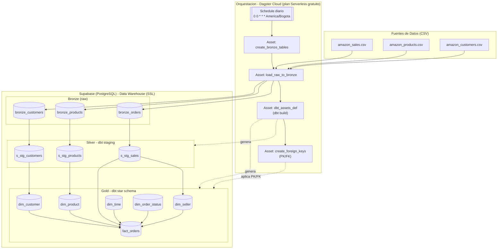

# Marketplace DW

Data warehouse de un marketplace estilo Amazon, construido con arquitectura **medallion** (Bronze → Silver → Gold). El pipeline ingiere datos crudos de ventas, productos y clientes, los transforma con **dbt** y los deja listos para análisis en un esquema estrella sobre **PostgreSQL (Supabase)**, todo orquestado con **Dagster Cloud**.

## Arquitectura



El diagrama editable está en [`arquitectura_pipeline.mermaid`](./arquitectura_pipeline.mermaid).

## Stack tecnológico

| Capa | Herramienta |
|---|---|
| Orquestación | Dagster (Dagster Cloud, plan Serverless gratuito) |
| Transformación | dbt (dbt-core + dbt-postgres) |
| Almacenamiento | PostgreSQL alojado en Supabase |
| Ingesta / scripting | Python (pandas, SQLAlchemy, psycopg2) |
| Generación de datos de prueba | Faker |

## Modelo de datos

**Bronze** — datos crudos cargados tal cual desde los CSV:
`bronze_orders`, `bronze_products`, `bronze_customers`

**Silver** — staging con tipado, limpieza y filtros básicos (dbt):
`s_stg_sales`, `s_stg_products`, `s_stg_customers`

**Gold** — esquema estrella para análisis (dbt), con llaves primarias y foráneas aplicadas por el asset `create_foreign_keys`:
- `fact_orders` (tabla de hechos)
- `dim_customer`, `dim_product`, `dim_seller`, `dim_time`, `dim_order_status`

## Estructura del repositorio

```
marketplace_dw_project/
├── dagster_project/          # Definiciones de Dagster
│   ├── assets/
│   │   ├── bronze.py         # Carga de CSV a Bronze
│   │   ├── dbt_assets.py     # Ejecuta `dbt build`
│   │   └── gold.py           # Aplica PK/FK sobre Gold
│   ├── definitions.py
│   └── jobs.py                # Job + schedule diario
├── dbt/                        # Proyecto dbt (Silver + Gold)
│   ├── models/
│   │   ├── bronze/            # Definición de sources
│   │   ├── silver/            # Modelos de staging
│   │   └── gold/               # Dimensiones y tabla de hechos
│   └── profiles.yml
├── etl_python/
│   └── generate_sales_data.py # Generador de datos de prueba (Faker)
├── data/raw/                  # CSV de origen
├── dagster.yaml / dagster_cloud.yaml
├── Dockerfile
└── requirements.txt
```

## Requisitos previos

- Python 3.9+
- Cuenta de [Supabase](https://supabase.com) con una base de datos PostgreSQL
- Cuenta de [Dagster Cloud](https://dagster.io/cloud) (opcional, solo para desplegar en la nube)

## Configuración

1. Clona el repositorio e instala dependencias:

```bash
git clone <url-del-repo>
cd marketplace_dw_project
python -m venv venv
./venv/Scripts/activate   # En Windows
pip install -r requirements.txt
```

2. Crea un archivo `.env` en la raíz del proyecto con las credenciales de tu base de datos Supabase:

```
DB_HOST=xxxxx.supabase.co
DB_PORT=5432
DB_NAME=postgres
DB_USER=postgres
DB_PASSWORD=tu_password
DB_SCHEMA=public
```

> El `.env` está en `.gitignore` — nunca subas credenciales al repositorio.

## Uso

**Generar datos de prueba** (opcional, ya existen CSV de ejemplo en `data/raw/`):

```bash
python etl_python/generate_sales_data.py
```

**Levantar Dagster en local:**

```bash
dagster dev -f dagster_project/definitions.py
```

Desde la UI de Dagster (`http://localhost:3000`) puedes materializar los assets manualmente o dejar que corran con el schedule diario (`00:00 America/Bogota`).

**Ejecutar solo dbt:**

```bash
cd dbt
dbt build
```

## Despliegue

El proyecto está configurado para desplegarse en **Dagster Cloud** (`dagster_cloud.yaml`) usando el plan Serverless gratuito, y también incluye un `Dockerfile` para levantar el webserver de Dagster en un contenedor propio si se prefiere.
