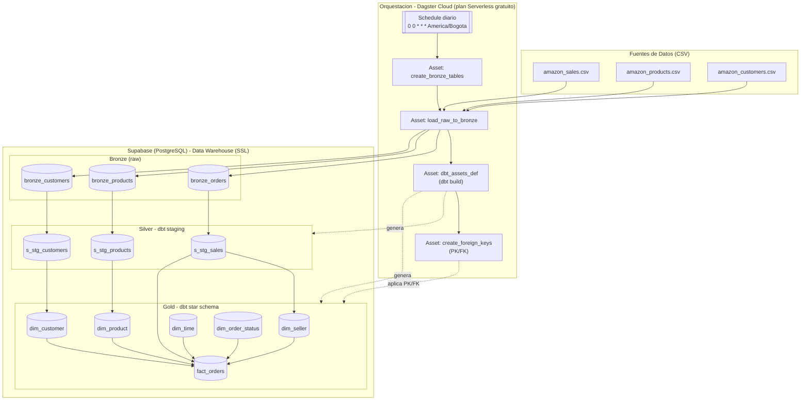
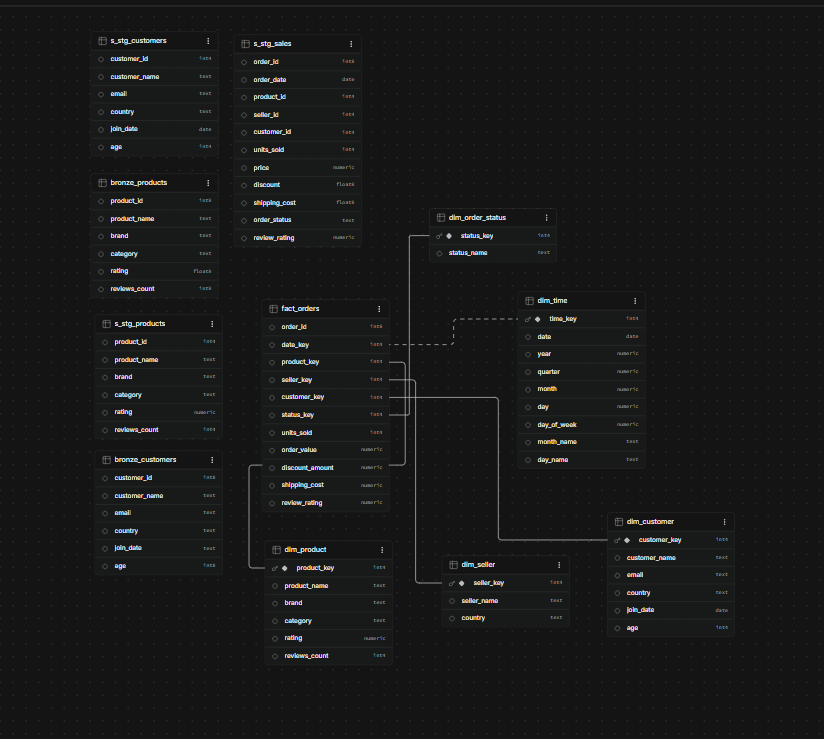
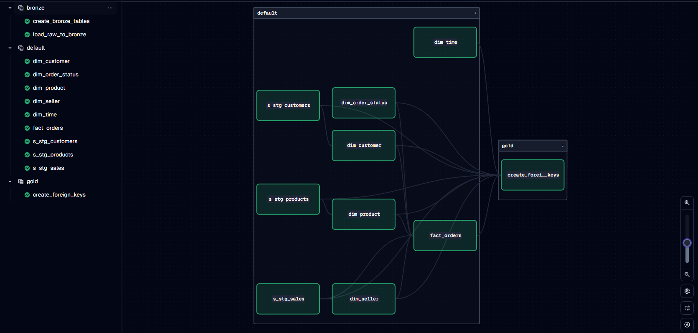

<div align="center">

# 🛒 Marketplace DW

**Data warehouse de un marketplace estilo Amazon**, construido con arquitectura **medallion** (Bronze → Silver → Gold).
Ingesta de ventas, productos y clientes → transformación con **dbt** → esquema estrella listo para análisis, todo orquestado con **Dagster**.

[](https://www.python.org/)
[](https://www.getdbt.com/)
[](https://dagster.io/)
[](https://supabase.com/)
[](https://www.docker.com/)

</div>

---

## 📑 Contenido

- [Highlights](#highlights)
- [Arquitectura](#arquitectura)
- [Requisitos previos](#requisitos-previos)
- [Configuración](#configuración)
- [Uso](#uso)
- [Despliegue](#despliegue)
- [Stack tecnológico](#stack-tecnológico)
- [Modelo de datos](#modelo-de-datos)
- [Estructura del repositorio](#estructura-del-repositorio)
- [Modelo entidad-relación](#modelo-entidad-relación-supabase)
- [Grafo de assets en Dagster](#grafo-de-assets-en-dagster)
- [Contacto](#contacto)

---

<a id="highlights"></a>
## ✨ Highlights

- **Pipeline ELT end-to-end** con arquitectura medallion (Bronze → Silver → Gold) sobre datos transaccionales de e-commerce.
- **Orquestación basada en assets** con Dagster: dependencias declarativas, materialización y schedule diario automatizado.
- **Modelado dimensional** en dbt: staging limpio + esquema estrella (1 tabla de hechos, 5 dimensiones) con integridad referencial (PK/FK).
- **100% cloud y gratuito**: PostgreSQL en Supabase + orquestación en Dagster Cloud (plan Serverless).
- **Documentado y reproducible**: diagrama de arquitectura versionado, generador de datos sintéticos incluido y setup en minutos.

---

<a id="arquitectura"></a>
## 🏗️ Arquitectura



📄 Diagrama editable: [`arquitectura_pipeline.mermaid`](./img/arquitectura_pipeline.mermaid)

---

<a id="requisitos-previos"></a>
## ⚙️ Requisitos previos

- Python 3.9+
- Cuenta de [Supabase](https://supabase.com) con una base de datos PostgreSQL
- Cuenta de [Dagster Cloud](https://dagster.io/cloud) (opcional, solo para desplegar en la nube)

---

<a id="configuración"></a>
## 🚀 Configuración

1. Clona el repositorio e instala dependencias:

```bash
git clone <url-del-repo>
cd marketplace_dw_project
python -m venv venv
./venv/Scripts/activate   # En Windows
pip install -r requirements.txt
```

2. Crea un archivo `.env` en la raíz del proyecto con las credenciales de tu base de datos Supabase:

```
DB_HOST=xxxxx.supabase.co
DB_PORT=5432
DB_NAME=postgres
DB_USER=postgres
DB_PASSWORD=tu_password
DB_SCHEMA=public
```

> ⚠️ El `.env` está en `.gitignore` — nunca subas credenciales al repositorio.

---

<a id="uso"></a>
## ▶️ Uso

**Generar datos de prueba** (opcional, ya existen CSV de ejemplo en `data/raw/`):

```bash
python etl_python/generate_sales_data.py
```

**Levantar Dagster en local:**

```bash
dagster dev -f dagster_project/definitions.py
```

Desde la UI de Dagster (`http://localhost:3000`) puedes materializar los assets manualmente o dejar que corran con el schedule diario (`00:00 America/Bogota`).

**Ejecutar solo dbt:**

```bash
cd dbt
dbt build
```

---

<a id="despliegue"></a>
## ☁️ Despliegue

El proyecto está configurado para desplegarse en **Dagster Cloud** (`dagster_cloud.yaml`) usando el plan Serverless gratuito, y también incluye un `Dockerfile` para levantar el webserver de Dagster en un contenedor propio si se prefiere.

---

<a id="stack-tecnológico"></a>
## 🧰 Stack tecnológico

| Capa | Herramienta |
|---|---|
| 🎛️ Orquestación | Dagster (Dagster Cloud, plan Serverless gratuito) |
| 🔄 Transformación | dbt (dbt-core + dbt-postgres) |
| 🗄️ Almacenamiento | PostgreSQL alojado en Supabase |
| 🐍 Ingesta / scripting | Python (pandas, SQLAlchemy, psycopg2) |
| 🧪 Datos de prueba | Faker |
| 📦 Contenerización | Docker |

---

<a id="modelo-de-datos"></a>
## 🗃️ Modelo de datos

| Capa | Tablas | Propósito |
|---|---|---|
| 🥉 **Bronze** | `bronze_orders`, `bronze_products`, `bronze_customers` | Datos crudos cargados tal cual desde los CSV |
| 🥈 **Silver** | `s_stg_sales`, `s_stg_products`, `s_stg_customers` | Staging con tipado, limpieza y filtros básicos (dbt) |
| 🥇 **Gold** | `fact_orders` + `dim_customer`, `dim_product`, `dim_seller`, `dim_time`, `dim_order_status` | Esquema estrella con PK/FK, listo para BI/análisis |

---

<a id="estructura-del-repositorio"></a>
## 📂 Estructura del repositorio

```
marketplace_dw_project/
├── dagster_project/          # Definiciones de Dagster
│   ├── assets/
│   │   ├── bronze.py         # Carga de CSV a Bronze
│   │   ├── dbt_assets.py     # Ejecuta `dbt build`
│   │   └── gold.py           # Aplica PK/FK sobre Gold
│   ├── definitions.py
│   └── jobs.py                # Job + schedule diario
├── dbt/                        # Proyecto dbt (Silver + Gold)
│   ├── models/
│   │   ├── bronze/            # Definición de sources
│   │   ├── silver/            # Modelos de staging
│   │   └── gold/               # Dimensiones y tabla de hechos
│   └── profiles.yml
├── etl_python/
│   └── generate_sales_data.py # Generador de datos de prueba (Faker)
├── data/raw/                  # CSV de origen
├── img/                        # Diagramas e imágenes de arquitectura
├── dagster.yaml / dagster_cloud.yaml
├── Dockerfile
└── requirements.txt
```

---

<a id="modelo-entidad-relación-supabase"></a>
## 🧬 Modelo entidad-relación (Supabase)

Vista real del esquema en el editor de tablas de Supabase, con las relaciones entre `fact_orders` y sus dimensiones ya aplicadas por el asset `create_foreign_keys`:



---

<a id="grafo-de-assets-en-dagster"></a>
## 📊 Grafo de assets en Dagster

Lineage completo del pipeline en la UI de Dagster: ingesta a Bronze, modelos de dbt (Silver → Gold) y aplicación de llaves foráneas:



---

<a id="contacto"></a>
## 📬 Contacto

**Carlos Hoyos**
📧 [carloshoyos26@gmail.com](mailto:carloshoyos26@gmail.com)
🔗 [LinkedIn](https://www.linkedin.com/in/carlosmario-hoyosrios) · [GitHub](https://github.com/ingcarlosmariohoyos)

---

<div align="center">⭐ Si este proyecto te resulta útil o interesante, considera dejarle una estrella</div>
